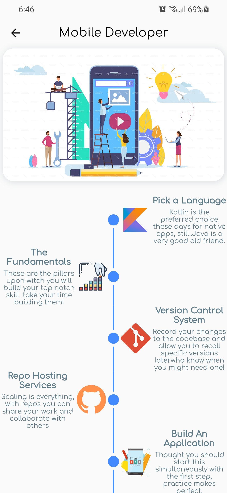
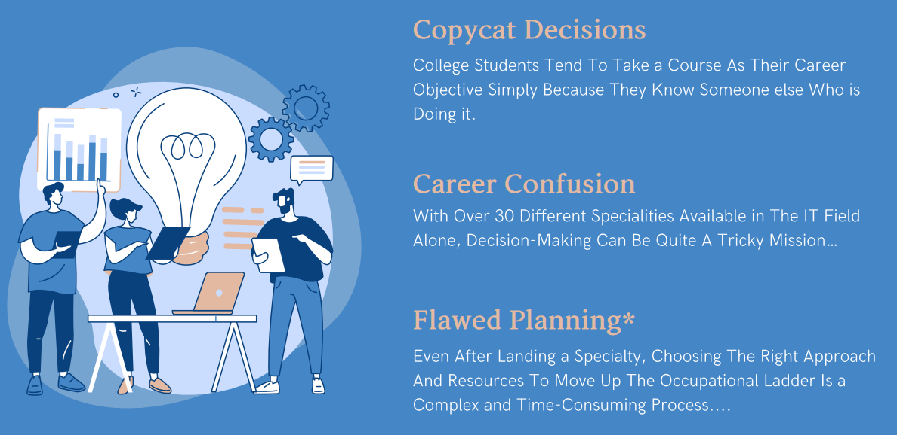
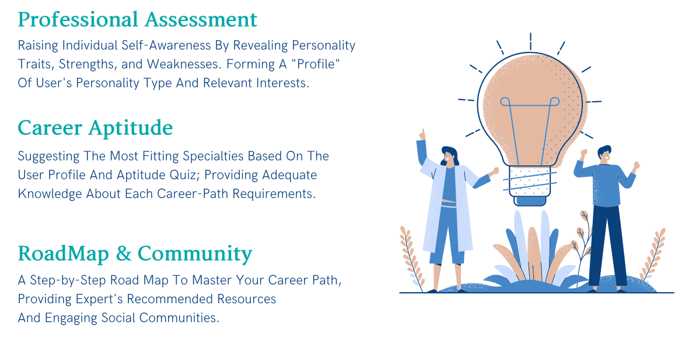
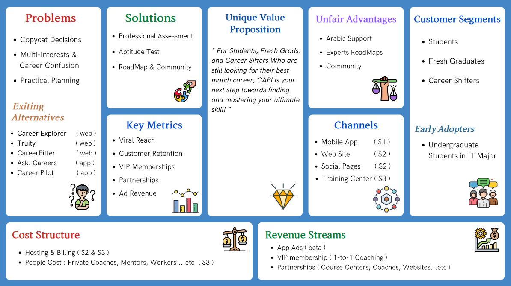

<div align="center">

</div>
<h1 align="center">CAPI</h1>
<h4 align="center"> Mobile-Based Comprehensive Career Guide and Development Tool </h4>

<div align="center">
    <a href="https://github.com/Mohamed-Shalaan/ProjectCAPI/graphs/commit-activity">
        
    </a>
    <a href="https://github.com/Mohamed-Shalaan/ProjectCAPI/releases">
        
    </a>
    <a href="https://github.com/Mohamed-Shalaan/ProjectCAPI/graphs/contributors">
        
    </a>
    <a href="http://makeapullrequest.com">
        
    </a>
    <a href="https://standardjs.com">
        
    </a>
    <a href="https://github.com/Mohamed-Shalaan/ProjectCAPI">
        
    </a>
  <a href="https://github.com/Mohamed-Shalaan/ProjectCAPI">
        
    </a>
     <a href="https://github.com/Mohamed-Shalaan/ProjectCAPI">
        
    </a>
    <a href="https://www.codacy.com?utm_source=github.com&amp;utm_medium=referral&amp;utm_content=Mohamed-Shalaan/ProjectCAPI&amp;utm_campaign=Badge_Grade">
        
    </a>
    <a href="https://github.com/Mohamed-Shalaan/ProjectCAPI/graphs/commit-activity">
        
    </a>
    <a href="https://github.com/Mohamed-Shalaan/ProjectCAPI">
        
    </a>
</div>

<br />

*If you have any improvements, do not hesitate to post an [issue](https://github.com/Mohamed-Shalaan/ProjectCAPI/issues/new/choose) or make a [pull request](https://github.com/Mohamed-Shalaan/ProjectCAPI/pulls).*
*Your support is very much appreciated!*

<p align="center">
    :warning: Active development. Unstable. Breaking changes. You get the point. :warning:
</p>


## :scroll: Table of Contents
*   [About the Project](#u6307-about-the-project)
    *   [Preview](#camera-screenshots)
    *   [Motives](#bulb-motives)
    *   [Target Market](#dart-target-market)
    *   [Competitive Advantages](#trophy-competitive-advantages)
    *   [Lean Canvas](#triangular_flag_on_post-lean-canvas)
 
  
*   [Source Code Directory Structure](#ladder-source-code-directory-structure)
*   [Getting Started](#biking_man-getting-started)
    *   [Prerequisites](#yellow_circle-prerequisites)
        *   [Package Manager](#package-package-manager)
        *   [Environment Variables](#key-environment-variables)
    *   [Run for Development](#wrench-run-for-development)
        *   [Run the Tests](#syringe-run-the-tests)
    *   [Deployment | Hosting](#sparkles-deployment--hosting)
*   [Usage](#thinking-usage)
*   [FAQ](#bulb-faq)
*   [Future Work](#rescue_worker_helmet-future-work)
*   [Contributors](#hatching_chick-contributors)
*   [License](#warning-license)

## :u6307: About the Project

`CAPI` stands for Career Aptitude Pocket Instructor

## :camera: Screenshots

<table width="100%">
  <tbody>
    <tr>
      <td width="1%"></td>
      <td width="1%"></td>
       <td width="1%"></td>
    </tr>
    <tr>
      <td width="1%"></td>
      <td width="1%"></td>
       <td width="1%"></td>
    </tr>
  </tbody>
</table>

***
## :bulb: Motives 

<h3 align="center">CAPI is a software solution to 3 main problems in career development</h3>

<h3 align="center"> CAPI's functions and features provide solutions for all those problems</h3>


***
## :dart: Target Market 

<h3 align="center"> According Statista.com, Capmas.gov.eg, and Wner.wes.com there are over 2.5 million fresh-grads in Egypy, with another 2.3 million full-day clerics who approached a career shift in the last year, all of them can benefit form CAPI's features .</h3>


***
## :trophy: Competitive Advantages

<h3 align="center"> CAPI offers a full package of features that sets it apart from all local and international competitors who only offers partial features for a price !.</h3>


***
## :triangular_flag_on_post: Lean Canvas
<h3 align="center"> A full view of the project's most vital elements and major steps.</h3>



### :closed\_lock\_with\_key: How Devault Works

**When you upload a file:**

*   The file gets encrypted using AES-256-CBC encryption.
*   The encrypted file is split into pieces.
*   The chunks are distributed across the network nodes.
*   The root hash will be stored in your wallet on the blockchain.

**When you download a file:**

*   The root hash will be retrieved from your wallet on the blockchain.
*   The root hash will be used to retrieve the file chunks.
*   The retrieved chucks will be combined and decrypted to represent the original file.

### :hammer\_and\_wrench: Tech Stack and Tools

The tools used in this project.

|                                                                      | Tool                                       | Description                                                                    |
|:--------------------------------------------------------------------:|:------------------------------------------:|:------------------------------------------------------------------------------:|
|     | [Neovim](https://neovim.io/)               | IDE                                                                      |
|  | [Next.js](https://nextjs.org/)             | Full stack framework                                                        |
|    | [Hardhat](https://hardhat.io)              | Framework for developing, testing, linting and deploying smart contracts  |
|   | [Solidity](https://docs.soliditylang.org/) | The smart contract language                                                   |
|   | [Metamask](https://metamask.io/)           | Web3 provider                                                             |
|   | [Ethers.js](https://docs.ethers.io/)       | Library for interacting with the Ethereum blockchain                      |
|   | [Ropsten](https://ropsten.etherscan.io/)   | Testnet for deploying smart contracts                                     |
|     | [Infura](https://infura.io/)               | Blockchain node as a service to deploy the smart contracts through it |
|       | [IPFS](https://ipfs.io/)                   | Storing, retrieving and sharing the encrypted files                                    |
|       | [Jest](https://jestjs.io/)                 | Unit testing and code coverage                                                              |
|   | [Etherscan](https://etherscan.io/)         | Verifying transactions and blocks                                          |
|     | [Vercel](https://vercel.com/)              | Production deployment                                           |
|     | [Docker](https://www.docker.com/)          | Deploying and shipping the app for production                              |

## :ladder: Source Code Directory Structure

A quick look at the top-level files and directories:

```sh
.
├── __tests__
├── artifacts
├── components
├── contracts
├── docker-compose.yml
├── Dockerfile
├── docs
├── hardhat.config.js
├── jest.config.js
├── next.config.js
├── out
├── package.json
├── pages
├── public
├── scripts
├── SECURITY.md
├── styles
├── .github
└── utils
```

*   1.  \_\_tests\_\_: contains all the unit tests
*   2.  artifacts: produced by hardhat after compiling the smart contracts and containing smart contracts ABIs.
*   3.  components: contains all the React components.
*   4.  contracts: contains all the smart contracts source code.
*   5.  docker-compose.yml: docker-compose file for serving the production build.
*   6.  Dockerfile: docker file for building and running next.js app used by docker-compose
*   7.  docs: contains all the source code documentation.
*   8.  hardhat.config.js: hardhat config file
*   9.  jest.config.js: jest config file
*   10. next.config.js: next.js config file
*   11. out: produced by `npm run build2` and contains a static site.
*   12. package.json: npm package manager config file
*   13. pages: contains all pages routes
*   14. public: contains all the assets (ex. images, fonts...)
*   15. scripts: contains all the scripts used to automate the development process (ex. deploy, logger...)
*   16. SECURITY: defining which version receives updates.
*   17. styles: contains all page styles.
*   18. .github: contains automated workflows (CI/CD).
*   19. utils: contains all javascript functions used by other components.

## :biking\_man: Getting Started

### :yellow\_circle: Prerequisites

#### :package: Package Manager

This project uses `npm` as a package manager

```sh
pacman -S npm
```

#### :key: Environment Variables

To run this project, you will need to add the following environment variables to your `.env` file

`PRIVATE_KEY`
`ROPSTEN_URL`

To generate those keys you will need to:

*   1.  create infura account
*   2.  create a new Ethereum node
*   3.  copy the private key to .env
*   4.  copy ropsten url to .env

`SMART_CONTRACT_ADDRESS_ROPSTEN`

This variable will be set later by the deployment script

### :wrench: Run for Development

*   Clone the repo

```sh
git clone https://github.com/AbdeltwabMF/devault.git
cd devault
```

*   Install dependencies

```sh
npm ci
```

*   Run the development server and local blockchain node.

```sh
npm run deploy localhost
```

*   Navigate to `http://localhost:3000` <br/>

:green\_circle: *Now you're good to go*

#### :syringe: Run the Tests

*   Run the smart contracts test

```sh
npx hardhat test
```

*   Generates a code coverage report for smart contracts test

```sh
npx hardhat coverage
```

*   Run the whole project tests

```sh
npm run test
```

### :sparkles: Deployment | Hosting

*   Deploy using source code and docker

```sh
git clone https://github.com/AbdeltwabMF/devault.git
cd devault
```

```sh
docker-compose up --build --force-recreate -d
```

*   Deploy using official docker image hosted on docker hub

```sh
docker container run -p 3000:3000 -d abdeltwabmf/devault
```

*   Deploy using vercel

```sh
npm i -g vercel
```

```sh
vercel --prod
```

*   Deploy using static site generation

The generated static site will be in the `out` directory (ex. use `nginx` to serve it)

```sh
npm run build2
```

## :thinking: Usage

*   1.  Create an Ethereum wallet using [metamask](https://metamask.io/) extension.
*   2.  Open [devault website](https://devault.vercel.app/).
*   3.  Click connect wallet and follow the steps.
*   4.  <details>
        <summary>Make sure you're on the ropsten network. (settings > advanced > show test networks)</summary>
        <ul>
         <li></li>
        </ul>
     </details>
*   5.  <details>
        <summary>Go to <a href="https://faucet.egorfine.com/">ropsten faucet</a> and paste your address to get some ethers. (used for transactions)</summary>
        <ul>
         <li></li>
        </ul>
     </details>
*   6.  Navigate to [The Vault](https://devault.vercel.app/vault) tab.
*   7.  Pick a file and press upload.
*   8.  Give a passphrase to encrypt the file. (you can use different passphrases for different files).
*   9.  Once the file is successfully uploaded it will appear on the same page with the option to download.
*   10. When downloading give the same passphrase you entered when uploading the file.
*   11. The file is now being downloaded.

## :bulb: FAQ

<details>
    <summary>Why metamask?</summary>
    <ul>
        <li>It's the most popular wallet out there, and it's the only wallet supported by the current version of devault.</li>
    </ul>
</details>

<details>
    <summary>Is it possible to upload files without ethers?</summary>
    <ul>
        <li>No, you should have some ethers to be able to write files' metadata to the blockchain.</li>
    </ul>
</details>

<details>
    <summary>What happens when I switch to another account</summary>
    <ul>
        <li>The files that is related to that account will be retrieved instead of the previous one.</li>
    </ul>
</details>

## :rescue\_worker\_helmet: Future Work

*   \[ ] Arabic version.
*   \[x] Client-side encryption/decryption.
*   \[x] Upload a file.
*   \[x] Delete a file.
*   \[x] Download a file.
*   \[x] Secure file sharing.
*   \[ ] Delete selected files.
*   \[ ] Search files.
*   \[ ] Change passphrase.
*   \[ ] Compress files before uploading.
*   \[ ] Sort files based on (date, size, name...)
*   \[ ] Upload folders.
*   \[ ] Download selected files.


## :hatching\_chick: Contributors

<table>
  <tr>
    <td align="center">
        <a href="https://github.com/Mohamed-Shalaan">
        <br />
            <sub><b>Mohamed Salah Shalaan</b></sub>
        </a>
    </td>
  </tr>
</table>

## :warning: License

Licensed under the [GPL-v3](LICENSE) License.
