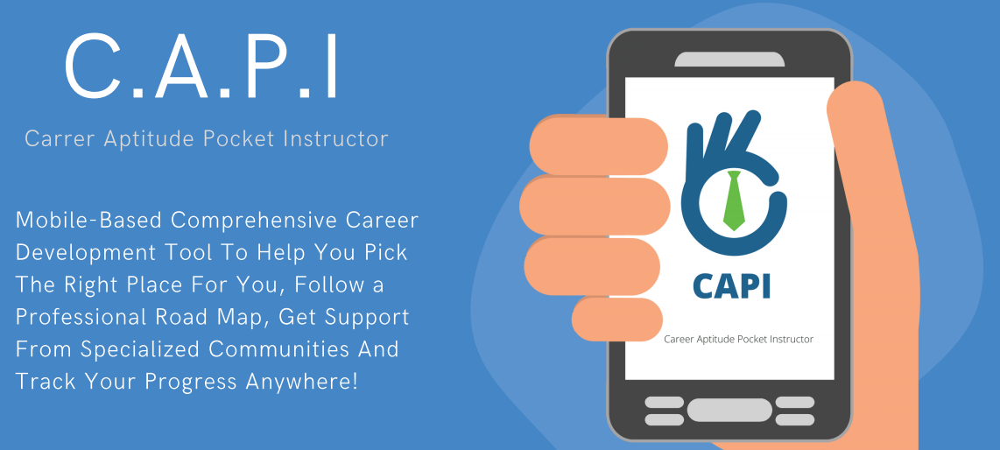
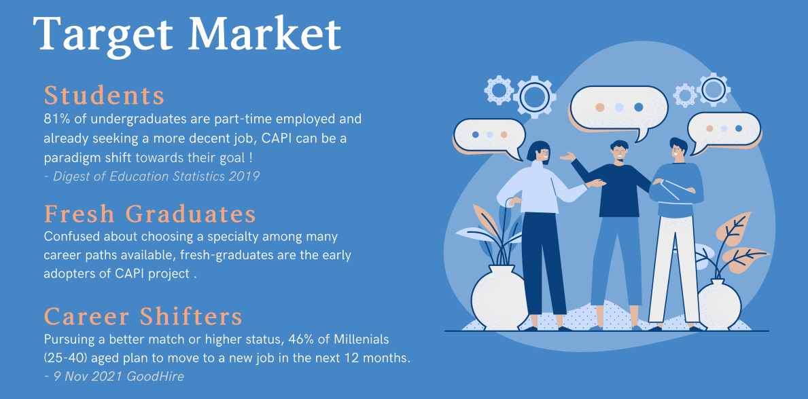
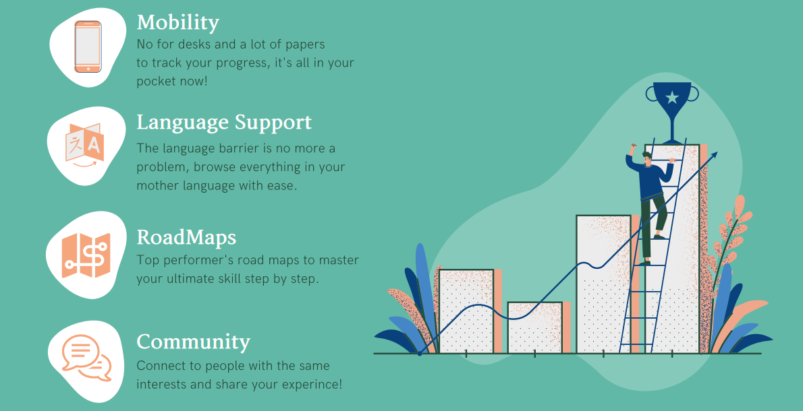

<h1 align="center">CAPI</h1>
<h4 align="center"> Mobile-Based Comprehensive Career Guide and Development Tool </h4>

    
    
    
    
    
    
  
     
    
    
    

 

*If you have any improvements, do not hesitate to post an [issue](https://github.com/Mohamed-Shalaan/ProjectCAPI/issues/new/choose) or make a [pull request](https://github.com/Mohamed-Shalaan/ProjectCAPI/pulls).*
*Your support is very much appreciated!*

    :warning: Active development. Unstable. Breaking changes. You get the point. :warning:

## :scroll: Table of Contents
*   [➤ About the Project](#u6307-about-the-project)
    *   [Preview](#camera-screenshots)
    *   [Motives](#bulb-motives)
    *   [Target Market](#dart-target-market)
    *   [Competitive Advantages](#trophy-competitive-advantages)
    *   [Lean Canvas](#triangular_flag_on_post-lean-canvas)

*   [➤ App Specifications & Structure](#hammer_and_wrench-app-specifications-and-structure)
    *   [System Architecture](#jigsaw-system-architecture)
    *   [Main Modules](#large_blue_diamond-main-modules)
    *   [Sub Modules](#small_blue_diamond-sub-madules)
    *   [Documentation](#bookmark_tabs-documentation)

*   [➤ Usage](#thinking-usage)
*   [➤ FAQ](#bulb-faq)
*   [➤ Future Work](#rescue_worker_helmet-future-work)
*   [➤ Contributors](#hatching_chick-contributors)
*   [➤ License](#warning-license)

***
# :u6307: About the Project

`CAPI` stands for Career Aptitude Pocket Instructor

## :camera: Screenshots

<table width="100%">
  <tbody>
    <tr>
      <td width="1%"></td>
      <td width="1%"></td>
       <td width="1%"></td>
    </tr>
    <tr>
      <td width="1%"></td>
      <td width="1%"></td>
       <td width="1%"></td>
    </tr>
  </tbody>
</table>

***
## :bulb: Motives 

<h3 align="center">CAPI is a software solution to 3 main problems in career development</h3>

<h3 align="center"> CAPI's functions and features provide solutions for all those problems</h3>

***
## :dart: Target Market 

<h3 align="center"> According Statista.com, Capmas.gov.eg, and Wner.wes.com there are over 2.5 million fresh-grads in Egypy, with another 2.3 million full-day clerics who approached a career shift in the last year, all of them can benefit form CAPI's features .</h3>

***
## :trophy: Competitive Advantages

<h3 align="center"> CAPI offers a full package of features that sets it apart from all local and international competitors who only offers partial features for a price !.</h3>

***
## :triangular_flag_on_post: Lean Canvas
<h3 align="center"> A full view of the project's most vital elements and major steps.</h3>

***
# :hammer_and_wrench: App Specifications and Structure

***
## :jigsaw: System Architecture

***
## :large_blue_diamond: Main Modules

***
## :small_blue_diamond: Sub Modules

***
## :bookmark_tabs: Documentation

# :thinking: Usage

*   1.  Create an Ethereum wallet using [metamask](https://metamask.io/) extension.
*   2.  Open [devault website](https://devault.vercel.app/).
*   3.  Click connect wallet and follow the steps.
*   4.  

        
Make sure you're on the ropsten network. (settings > advanced > show test networks)

        <ul>
         <li></li>
        </ul>
     

*   5.  

        
Go to <a href="https://faucet.egorfine.com/">ropsten faucet</a> and paste your address to get some ethers. (used for transactions)

        <ul>
         <li></li>
        </ul>
     

*   6.  Navigate to [The Vault](https://devault.vercel.app/vault) tab.
*   7.  Pick a file and press upload.
*   8.  Give a passphrase to encrypt the file. (you can use different passphrases for different files).
*   9.  Once the file is successfully uploaded it will appear on the same page with the option to download.
*   10. When downloading give the same passphrase you entered when uploading the file.
*   11. The file is now being downloaded.

# :bulb: FAQ

    
Why metamask?

    <ul>
        <li>It's the most popular wallet out there, and it's the only wallet supported by the current version of devault.</li>
    </ul>

    
Is it possible to upload files without ethers?

    <ul>
        <li>No, you should have some ethers to be able to write files' metadata to the blockchain.</li>
    </ul>

    
What happens when I switch to another account

    <ul>
        <li>The files that is related to that account will be retrieved instead of the previous one.</li>
    </ul>

# :rescue\_worker\_helmet: Future Work

*   \[ ] Arabic version.
*   \[x] Client-side encryption/decryption.
*   \[x] Upload a file.
*   \[x] Delete a file.
*   \[x] Download a file.
*   \[x] Secure file sharing.
*   \[ ] Delete selected files.
*   \[ ] Search files.
*   \[ ] Change passphrase.
*   \[ ] Compress files before uploading.
*   \[ ] Sort files based on (date, size, name...)
*   \[ ] Upload folders.
*   \[ ] Download selected files.

## :hatching\_chick: Contributors

<table>
  <tr>
    <td align="center">
        <a href="https://github.com/Mohamed-Shalaan">
         
            <b>Mohamed Salah Shalaan</b>
        </a>
    </td>
  </tr>
</table>

## :warning: License

Licensed under the [GPL-v3](LICENSE) License.
