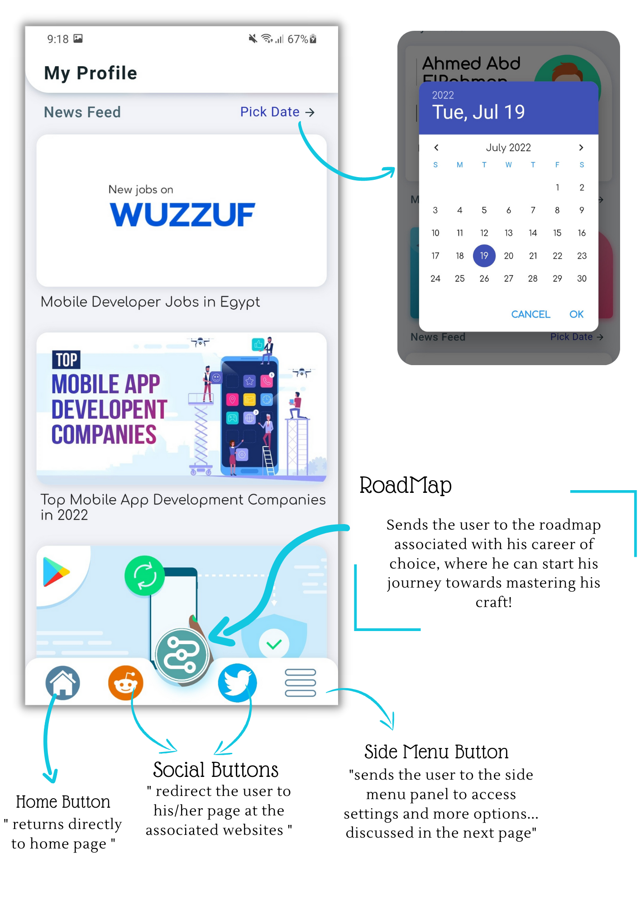
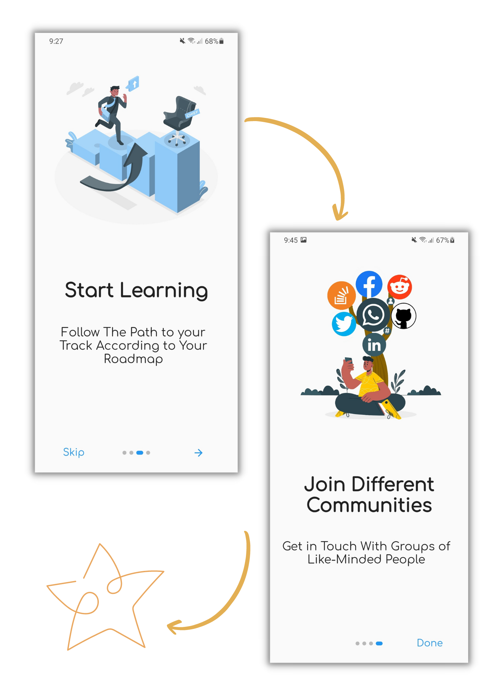

<h1 align="center">CAPI</h1>
<h4 align="center"> Mobile-Based Comprehensive Career Guide and Development Tool </h4>

    
    
     <a href="https://github.com/AbdeltwabMF/devault/blob/main/LICENSE">
        
    <a>
    
    
    
    
  
     
    
    
    

 

*If you have any improvements, do not hesitate to post an [issue](https://github.com/Mohamed-Shalaan/ProjectCAPI/issues/new/choose) or make a [pull request](https://github.com/Mohamed-Shalaan/ProjectCAPI/pulls).*
*Your support is very much appreciated!*

    :warning: Active development. Unstable. Breaking changes. You get the point. :warning:

## :scroll: Table of Contents
*   [➤ About the Project](#u6307-about-the-project)
    *   [Preview](#camera-screenshots)
    *   [Motives](#bulb-motives)
    *   [Target Market](#dart-target-market)
    *   [Competitive Advantages](#trophy-competitive-advantages)
    *   [Lean Canvas](#triangular_flag_on_post-lean-canvas)
*   [➤ App Specifications & Structure](#hammer_and_wrench-app-specifications-and-structure)
    *   [System Architecture](#jigsaw-system-architecture)
    *   [Main Modules](#large_blue_diamond-main-modules)
        *   [Assignment Module](#small_blue_diamond-assignment-module)
        *   [Profile Module](#small_blue_diamond-profile-module)
        *   [Roadmap Module](#small_blue_diamond-roadmap-module)
    *   [Sub Modules](#large_orange_diamond-sub-modules)
        *   [OnBoarding Screens](#small_orange_diamond-onboarding-screens)
        *   [Login and SignUp](#small_orange_diamond-login-and-signup)
        *   [Bottom Navigation Bar](#small_orange_diamond-bottom-navigation-bar)
        *   [Control Menu](#small_orange_diamond-control-menu)
    *   [Documentation](#bookmark_tabs-documentation)
*   [➤ FAQ](#bulb-faq)
*   [➤ Future Work](#rescue_worker_helmet-future-work)
*   [➤ Contributors](#hatching_chick-contributors)
*   [➤ License](#warning-license)

***
# :u6307: About the Project

`CAPI` stands for Career Aptitude Pocket Instructor

## :camera: Screenshots

<table width="100%">
  <tbody>
    <tr>
      <td width="1%"></td>
      <td width="1%"></td>
       <td width="1%"></td>
    </tr>
    <tr>
      <td width="1%"></td>
      <td width="1%"></td>
       <td width="1%"></td>
    </tr>
  </tbody>
</table>

***
## :bulb: Motives 

<h3 align="center">CAPI is a software solution to 3 main problems in career development</h3>

<h3 align="center"> CAPI's functions and features provide solutions for all those problems</h3>

***
## :dart: Target Market 

<h3 align="center"> According Statista.com, Capmas.gov.eg, and Wner.wes.com there are over 2.5 million fresh-grads in Egypy, with another 2.3 million full-day clerics who approached a career shift in the last year, all of them can benefit form CAPI's features .</h3>

***
## :trophy: Competitive Advantages

<h3 align="center"> CAPI offers a full package of features that sets it apart from all local and international competitors who only offer partial features for a price!</h3>

***
## :triangular_flag_on_post: Lean Canvas
<h3 align="center"> A full view of the project's most vital elements and major steps.</h3>

***
# :hammer_and_wrench: App Specifications and Structure

***
## :jigsaw: System Architecture

Following a layered architecture pattern, the system is composed of 3 layers:  
<strong>Presentation Layer:</strong> Contains the user interfaces. 
<strong>Services Layer:</strong>  Contains the system’s inner processes & services. 
<strong>Data Layer:</strong>  Contains the different databases located in the local disk. 

***
## :large_blue_diamond: Main Modules

In order to achieve the required system features and maintain simplicity we divided the
system into 3 main modules:  <strong>Assignment module</strong> ,<strong> Profile Module </strong> and <strong>Road-Map Module</strong> …

### :small_blue_diamond: Assignment Module

The first main module serves as a regulator or filter that takes the user through a set of questions 
based on the MBTI system and professional workplace traits studies and surveys to determine the user's strengths & weaknesses
that may affect His interactions with other co-workers and managers or even Their practical role within an organization,
Revealing the final result as a personality type code that is later Used to suggest the best matching careers from our data base

<table width="100%">
  <tbody>
    <tr>
      <td width="1%"></td>
      <td width="1%"></td>
    </tr>
  </tbody>
</table>

### :small_blue_diamond: Profile Module

This module is dedicated to the user’s personal information and preferences, it will serve as the
The landing page when he/she logs in after completing the First assignment quiz. It will contain the user’s name,
profile picture, and career …. It will also contain some field-specific skill-set recommendations based on professionals reviews; Furthermore,
it may contain some news feed related To his/her career of choice providing training, Internships, and job chances

<table width="100%">
  <tbody>
    <tr>
      <td width="1%"></td>
      <td width="1%"></td>
    </tr>
  </tbody>
</table>

### :small_blue_diamond: Roadmap Module

 This module is dedicated to enlightening the user on the best steps to take to reach mastery and in which order… 
the road map is constructed based on community pros Recommendations and personal experiences, to give the user a detailed step-by-step guide in his/her career. 
Furthermore, this part contains links to third-party web Apps and services to provide not just theoretical but also Practical guidance and hints on each branch of the roadmap

<table width="100%">
  <tbody>
    <tr>
      <td width="1%"></td>
    </tr>
  </tbody>
</table>

***
## :large_orange_diamond: Sub Modules

### :small_orange_diamond: OnBoarding Screens

 A number of introductory screens with symbolic illustrations and descriptive phrases to give the user a hint of the application’s
features and what to expect for his first-time experience… On Boarding screens appear at first time use only and can be
skipped; Only the logo screen appears each run after subscribing.

<table width="100%">
  <tbody>
    <tr>
      <td width="1%"></td>
      <td width="1%"></td>
    </tr>
  </tbody>
</table>

### :small_orange_diamond: Login and SignUp

Used to claim and save user’s credential data at first, and then used to link his quiz result and personal preferences into the database
To form the user’s profile… Another function of this module is to reset the password in case the user forgot his/her own password

<table width="100%">
  <tbody>
    <tr>
      <td width="1%"></td>
    </tr>
  </tbody>
</table>

### :small_orange_diamond: Bottom Navigation Bar

A very flexible module that includes many functions, located at the bottom of the main page, the navigation bar is mainly for going
back and forth between the main page and the roadmap page …. In addition to the road map button, the navigation bar also should 
also include the social pages buttons and the control menu button.

<table width="100%">
  <tbody>
    <tr>
      <td width="1%"></td>
    </tr>
  </tbody>
</table>

### :small_orange_diamond: Control Menu

The main two functions of this module are to allow the user to access the app settings and to logout if he desires so …
Another set of functions can be also included, quickly changing the app theme (dark & light), sharing the app with others on social
websites, and the famous About-Us page to give a quick background about the Devs and their different products and contact data.

  <tbody>
    <tr>
      <td width="1%"></td>
    </tr>
  </tbody>
</table>

***
## :bookmark_tabs: Documentation
<h3> You can read the <a href="md/CAPI-Rep0024.pdf">Full Documentation</a> Full Documentation for further details about the app analysis and infrastructures like User stories & user cases, Functional Requirements, Design Approach, Activity Diagram, Sequence Diagram, ERD Diagram, Implementation, and Testing ... etc </h3>

***
# :bulb: FAQ

    
Who Can Use The App 

    <ul>
        <li>CAPI is designed to serve anyone still searching for a befitting career, and it will be available in both Arabic and English in full release, thus allowing a wider range of users.</li>
    </ul>

    
Why The MBTI Test ?

    <ul>
        <li> MBTI personality test is based on Myers and Briggs' theory of sixteen personality types and is specifically designed
         to help you discover the right career for your type. Taking this career test is more accurate than simply looking at a list
         of jobs for your personality type because it measures your interests as well as your type, giving you a personalized list 
         of careers that suit your unique profile..
       </li>
    </ul>

    
What if the test results was wrong ?

    <ul>
        <li>You can always retake the test anytime, plus once you enter one of the communities provided by the app,
        you will know whether this is where you should be or not
        </li>
    </ul>

***
# :rescue\_worker\_helmet: Future Work

*   \[ ] Adding the Arabic Language.
*   \[ ] Implementing Account Recovery.
*   \[ ] Adding Account Data Sync.
*   \[x] Enhancing the Assessment Quiz
*   \[x] Upgrading the Careers DB
*   \[ ] Adding a Progress Monitor Feature
*   \[x] Adding User Chat
*   \[ ] Implementing VIP System

## :hatching\_chick: Contributors

<table>
  <tr>
    <td align="center">
        <a href="https://github.com/Mohamed-Shalaan">
         
            <b>Mohamed Salah Shalaan</b>
        </a>
    </td>
  </tr>
</table>

## :warning: License

Licensed under the [GPL-v3](LICENSE) License.
